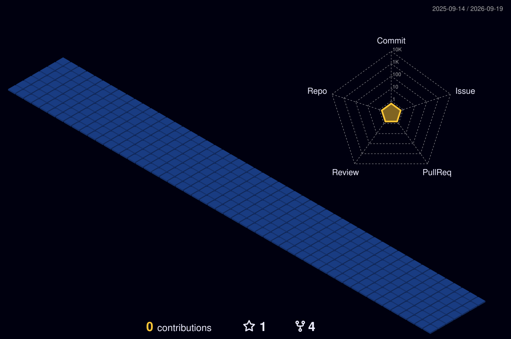

  
  
   
  
  

---

### 🚀 About Me

  <code>print("Hello, World!")</code>

- 🔭 I’m currently crafting seamless digital experiences and robust backends.
- 🌱 I’m currently deep-diving into modern web architectures and generative AI.
- 👯 I’m looking to collaborate on open-source tools and innovative tech products.
- ⚡ **Fun fact**: I believe code is just another medium for creating art!

---

### 💻 Tech Stack & Tools

  

---

### 📊 GitHub Analytics

  

---

### 🌌 3D Contribution Graph

*(Auto-generated daily via GitHub Actions)*

  

 

  

